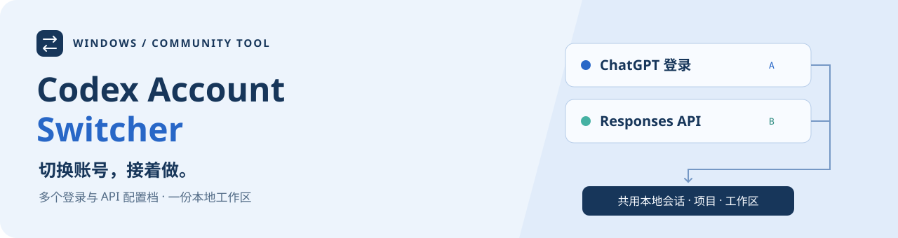
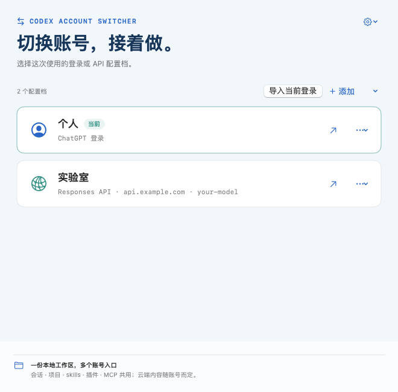
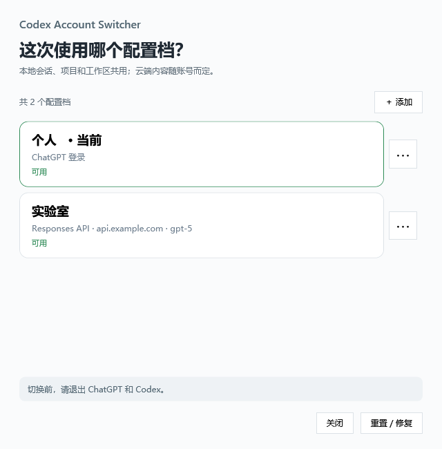

  

  
  
  
  
  

  <strong>ChatGPT 账号与 Responses API，在一个窗口里管理。</strong> 
  切换登录和接口，继续使用同一份本地会话、项目与工作区。

  <a href="https://github.com/sheyinjue-a11y/codex-account-switcher/releases/tag/v0.2.0"><strong>↓ 下载 Windows / macOS</strong></a>
  &nbsp; · &nbsp; <a href="#快速开始">快速开始</a>
  &nbsp; · &nbsp; <a href="#界面预览">看看界面</a>
  &nbsp; · &nbsp; <a href="https://github.com/sheyinjue-a11y/codex-account-switcher/releases">更新记录</a>

> **适用范围**：Windows 与 macOS / 中文图形界面 / 官方 Codex 桌面账号切换。独立社区工具，非 OpenAI 官方产品；不切换 ChatGPT 网页或通用聊天客户端。下载包不附带账号、Key 或额度。

## 能做什么

| 你要做的事 | 在切换器里 |
| :--- | :--- |
| 在多个 ChatGPT 账号间切换 | 浏览器登录、重复账号检测、重新登录与取消登录 |
| 保存不同 API 服务 | 每档独立的 Base URL、Key 和默认模型 |
| 整理账号列表 | 添加、重命名、编辑，删除非活动档 |
| 接着处理原来的工作 | 共用本地会话、项目和工作区；云端内容随账号而定 |
| 安全地保存和切换 | Windows DPAPI；macOS 钥匙串密钥 + AES-GCM；进程检查、失败回滚和中断恢复 |

旧个人／实验室双档安装可迁移，原实验室路由兼容逻辑保留；新建 API 档按你填写的服务和模型工作。

## 界面预览

### macOS · 原生 SwiftUI

  

由 Mac runner 运行原生窗口生成，使用演示数据；非网页或 CLI 截图。

### Windows · WPF

  

实际 WPF 界面，使用演示数据；不包含真实账号、服务地址或凭据。

## 快速开始

| 系统 | 下载与入口 |
| --- | --- |
| **macOS** | Release 中的 `Codex-Account-Switcher-macOS-universal.zip`，解压后把 `.app` 拖进「应用程序」，双击使用。[Mac 安装说明](macos/README.md) |
| **Windows** | Release 中的 `Codex-Account-Switcher-Windows.zip`，完整解压，按下方步骤操作。 |

### macOS

先备份 `~/.codex`，安装官方 Codex.app，再打开切换器。用「导入当前登录」或「＋ 添加 → ChatGPT 账号」建立账号库，也可添加 Responses API；点击配置档，确认后正常退出并重开 Codex。日常操作不需要终端。

Mac 工具为 macOS 13+ Universal 应用；官方 Codex 的系统和芯片要求仍以官方为准。**当前仅 ad-hoc 签名、未经 Apple 公证**，首次打开可能被系统拦截。核验来源后，由用户本人决定是否允许；不要关闭 Gatekeeper。真实 Mac 登录、桌面账号切换和历史显示仍需人工验收。[完整限制与恢复方法](macos/README.md)

### Windows

**先准备好官方 Codex，之后只需「安装一次，双击启动」。**

1. 安装官方 Codex Windows 桌面应用和 CLI，确认终端能运行 `codex.exe --version`。项目依赖 Windows PowerShell 5.1 / WPF（Windows 自带）；日常使用不需要 Python、Node.js 或开发环境。
2. 先在 Codex 登录自己的第一个账号。工具需要 `%USERPROFILE%\.codex\auth.json` 文件登录；如果尚未生成，双击 `Login.cmd`，在浏览器完成官方登录。此操作可能替换当前登录，先关闭 Codex 并备份已有凭据。不要分享该文件。
3. 下载并**完整解压**仓库 ZIP，放到准备长期保留的目录。首次使用前备份 `%USERPROFILE%\.codex`；已有旧版还需备份 `%LOCALAPPDATA%\CodexAccountSwitcher`。备份含敏感数据，勿上传。
4. 退出 Codex 桌面、CLI 和编辑器中的 Codex，双击 `Setup.cmd`。它导入当前账号，或迁移旧版账号库，并创建桌面快捷方式。无需管理员权限。
5. 双击 `Start.cmd` 或桌面 **Codex Account Switcher**。用「＋ 添加」增加 ChatGPT 或 API 配置档，点击卡片切换并启动 Codex。

如果 Windows 阻止下载的脚本，请先检查文件来源和代码；在 ZIP 属性中解除阻止后重新解压。不要全局降低 PowerShell 执行策略。企业策略限制脚本时请联系管理员。

官方客户端来源见 [OpenAI Codex 仓库](https://github.com/openai/codex)；本工具不捆绑或自动安装官方客户端。

## API 怎么填

添加 API 时填写服务商提供的 **Responses API 基础地址**（不是 `/responses` 完整路径），例如 `https://api.example.com/v1`。HTTPS 为默认要求，仅本机回环测试地址允许 HTTP。不支持 Chat Completions-only 服务。模型名称由服务商决定，项目不保证任何特定模型可用。

编辑 API 时，Key 留空表示保留原 Key。保存只进行本地格式检查；「测试连接」需要确认，可能消耗额度。切换器不会提供会员权益、共享额度或绕过服务商限制。

macOS 预览版只允许编辑非活动 API 档，暂不提供「测试连接」按钮；Windows 版保留原功能。

## 数据与限制

| 内容 | 位置 |
| --- | --- |
| 共享会话、项目与活动登录 | `%USERPROFILE%\.codex` |
| 加密账号库与恢复记录 | `%LOCALAPPDATA%\CodexAccountSwitcher` |
| 程序 | 当前解压目录 |

上表为 Windows 路径。macOS 共享目录是 `~/.codex`，加密账号库在 `~/Library/Application Support/CodexAccountSwitcher`，密钥在本机登录钥匙串。两端加密库不互通，不提供跨电脑凭据迁移。

两端都不按账号分离本地会话、项目、skills、插件、MCP 和工作区。账号切换只更新认证及必要路由；**共享本地数据不等于云端内容跨账号互通**。macOS 对复杂根配置、自定义 provider、配置 profile 和自定义 `CODEX_HOME` 会拒绝修改，详见 Mac 说明。

切换前必须退出所有使用共享目录的 Codex 进程；不支持不同账号并行运行。当前版本仅管理默认 `.codex`，不导入自定义 `CODEX_HOME`。首次导入支持内置 `openai` provider；已有自定义 provider 会被拒绝，不会静默重写，可先登录官方账号，再在工具中添加 API 档。

当前配置档和最后一个有效配置档不能删除。「重置 / 修复」用于校验和恢复，不是清空账号或历史的出厂重置。

共享的是本地历史，不保证不同账号的云端任务或云端同步互通。**切到另一 API 后，继续已有会话可能把该会话的历史发送给新服务商。** 仅使用你信任且允许接收这些内容的服务。

活动 `auth.json` 仍是官方客户端需要读取的凭据文件；DPAPI 保护的是工具保存的副本，不抵御当前用户权限下的恶意程序。加密文件不应当作跨电脑可恢复的备份。详见 [安全说明](SECURITY.md)。

## 常见问题

<strong>展开安装、切换与卸载排查</strong>

- **提示进程仍在运行**：退出桌面、终端和编辑器集成后重试。工具不会强制结束你的任务。
- **第一次没有账号**：按快速开始完成文件登录，再点「重置 / 修复」。API-only 用户也可导入已由官方 CLI 保存的 API 登录。
- **提示账号身份不一致**：若当前登录对应已注册账号，工具可校正状态；未知账号不会覆盖旧档。先备份再排查，不要手工删除凭据或恢复记录。
- **切换成功但没启动**：登录已切换，确认官方桌面应用安装正常，再点相同配置档。
- **移动了解压目录**：`Start.cmd` 仍可用；删除旧快捷方式后重跑 `Setup.cmd` 生成新快捷方式。安装器不会覆盖已有同名快捷方式。
- **如何卸载**：删除程序目录和快捷方式即可停止使用。共享 `.codex` 与账号库不会自动删除，避免误删历史。若要永久移除凭据，先确认备份和当前登录。

## 验证与开发

本地与 [GitHub Windows CI](https://github.com/sheyinjue-a11y/codex-account-switcher/actions/runs/35187258570) 均已完成公开版回归：**12 组 PowerShell/WPF 测试**，以及本地三路由共享会话测试的 **9 次模拟请求**。测试不调用真实付费模型。

<strong>查看测试命令与兼容性边界</strong>

运行 `powershell.exe -NoProfile -ExecutionPolicy Bypass -File tools\chatgpt-account-switch\Test-All.ps1 -SkipSharedSessions` 执行离线 PowerShell/WPF 回归。测试使用临时目录和假凭据，不切换真实账号。

共享会话集成测试另需 Python 3.12+、`zstandard` 和官方 CLI：`python tools\chatgpt-account-switch\Test-SharedSessions.py`。它使用本地模拟服务，不发送真实付费请求。详见 [开发说明](CONTRIBUTING.md)。

2026-09-17 已在 Windows PowerShell 5.1 / Codex CLI 0.154.0 下验证公开包：12 组 PowerShell/WPF 回归通过；三路由共享会话集成测试的 9 次本地模拟请求通过；PowerShell 语法及发布清单检查通过。真实浏览器授权、不同机器的桌面启动和真实服务连接仍需用户验收。官方客户端更新可能改变认证或配置格式；请先备份再升级。

当前为公开预览版。真实浏览器授权、不同机器的桌面启动和真实 API 服务仍需人工验收；首次安装和升级前请备份。

2026-09-23 [Mac CI](https://github.com/sheyinjue-a11y/codex-account-switcher/actions/runs/35837051191) 已通过 **16 项 Swift 测试、9 次本地模拟共享会话请求、arm64/x86_64 双架构构建、签名/包检查及原生窗口渲染**；[Windows 回归](https://github.com/sheyinjue-a11y/codex-account-switcher/actions/runs/35837051294) 同时通过。测试不读取真实凭据、不请求付费模型；编译通过不代表真实账号端到端验收。

## 许可证

[MIT](LICENSE)。OpenAI、Codex、ChatGPT 名称归相应权利人所有；公开包不包含从官方客户端提取的图标，也不暗示官方背书。
